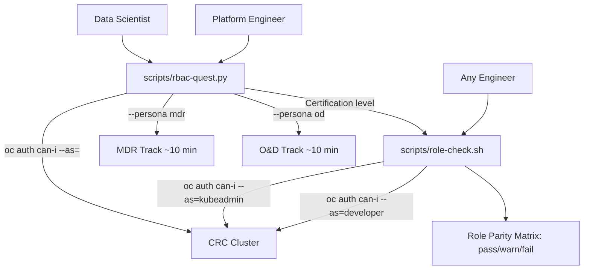
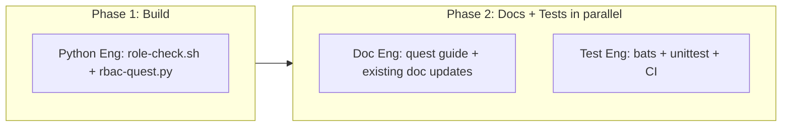

# RBAC Onboarding Gamification Plan

## Problem

Two personas must collaborate on RHOAI but have fundamentally different trust boundaries:

- **Platform Engineers** (Optics & Design) configure the cluster, deploy operators, manage groups and quotas. They touch cluster-scoped resources. In regulated environments, they are the ones auditors hold accountable.
- **Data Scientists** (Macrodata Refinement) create projects, launch workbenches, build pipelines, deploy models. They work within namespace-scoped boundaries. In regulated environments, they must not be able to access data or infrastructure outside their authorized scope.

The existing [roles-and-permissions.md](docs/roles-and-permissions.md) explains the `developer` vs `kubeadmin` split but does not connect it to these personas, their collaborative workflows, or the enterprise trust requirements that make RBAC a compliance gate. It also explicitly calls out:

> "Testing the dashboard and feature access across roles is critical but is not yet automated in this repo."

This plan fills that gap with persona-grounded, enterprise-motivated gamification.

## Lumon Division Mapping

The Severance theming maps cleanly to regulated-industry trust boundaries:

- **Macrodata Refinement (MDR)** = Data Scientists. They refine data, train models, run pipelines. Namespace-scoped. Cannot see the operator, cannot modify cluster config, cannot access other divisions' projects. In a bank: the quant team that builds credit risk models. In a telco: the network optimization ML team.
- **Optics & Design (O&D)** = Platform Engineers. They design and maintain the infrastructure. Cluster-scoped access to operators, DSC/DSCI, group membership, quotas. In a bank: the platform team that provisions the ML environment for regulated workloads. In a telco: the infra team that ensures the AI platform meets SOC 2 / ISO 27001.
- **The Board** = Cluster Admin (`kubeadmin`). Used only for initial deployment and break-glass scenarios. In a regulated environment, every Board action should be auditable and rare. The goal is to never need the Board for day-to-day operations.
- **Wellness Session** = Compliance/audit checkpoints within the quest system. Moments where the engineer must explain *why* a boundary exists, not just observe that it does.

## Technology Split

- **`scripts/role-check.sh`** (Bash) -- the automated parity matrix. **Primary deliverable.** Structurally identical to `smoke.sh`. Uses `oc auth can-i --as=` impersonation (never changes `oc` context). RHOAI version-aware.
- **`scripts/rbac-quest.py`** (Python 3 + `rich`) -- interactive quest runner. **Optional deep-dive.** Single pip dep (`rich`), install via `uv pip install rich` or `pipx`. Stdlib for everything else. Uses `--as=` impersonation, not login juggling. Cluster health gate. Trap-based cleanup.

## Architecture



## Execution Sequencing



Phase 1 (Python Engineer) produces the scripts. Phase 2 (Doc Engineer + Test Engineer) runs in parallel once scripts exist. Doc and Test engineers have no dependencies on each other.

---

## Workstream A: Python Engineer

**Owns:** `scripts/role-check.sh`, `scripts/rbac-quest.py`

**Sequence:** Build `role-check.sh` first (primary deliverable, bash), then `rbac-quest.py` (Python).

### A1: `scripts/role-check.sh` -- Cross-Persona Parity Matrix

Bash script. Sources [scripts/lib.sh](scripts/lib.sh). Reuses `pass()`/`warn()`/`fail()` pattern from [scripts/smoke.sh](scripts/smoke.sh). All checks via `oc auth can-i --as=` impersonation -- **never changes login context**.

**Key implementation patterns to follow from existing codebase:**
- Shebang: `#!/usr/bin/env bash` + `set -euo pipefail`
- Source lib.sh: `source "${SCRIPT_DIR}/lib.sh"`
- Use `use_crc_context` to verify cluster access
- Output style: `pass()`, `warn()`, `fail()`, `section()` functions matching `smoke.sh`
- Lumon echo banner at top

**RHOAI version detection:** Read installed CSV name from `oc get subscription rhods-operator -n openshift-operators -o jsonpath='{.status.installedCSV}'` to extract version. Use version to skip/adapt checks for API changes (following the fallback pattern in `smoke.sh` lines 68-88).

**MDR persona checks (impersonating `developer`):**
- `oc auth can-i create projects --as=developer` = `yes`
- `oc auth can-i get nodes --as=developer` = `no`
- `oc auth can-i get dscinitializations --as=developer` = `no`
- `oc auth can-i list pods -n redhat-ods-applications --as=developer` = `no`
- `oc auth can-i list pods -n openshift-operators --as=developer` = `no`
- `oc auth can-i patch odhdashboardconfigs -n redhat-ods-applications --as=developer` = `no`
- `oc auth can-i create notebooks -n <test-ns> --as=developer` = `yes`

**O&D persona checks (as current user, assumed `kubeadmin`):**
- `oc auth can-i get csv -n openshift-operators` = `yes`
- `oc auth can-i get datascienceclusters` = `yes`
- `oc auth can-i get dscinitializations` = `yes`
- `oc auth can-i create groups` = `yes`
- `oc auth can-i list namespaces` = `yes`
- Operator pods running

**Cross-persona config checks:**
- `disableKServeAuth` is `false` in dashboard config (parse YAML or jsonpath)
- `disableProjectSharing` is `false`
- `allowedGroups` is `system:authenticated`
- Pipeline ServiceAccount bindings are namespace-scoped (check via `oc auth can-i --as=system:serviceaccount:<ns>:<sa> get secrets -n <other-ns>` = `no`)

**Output:** pass/warn/fail summary grouped by persona. Exit code 0 = all pass.

### A2: `scripts/rbac-quest.py` -- Department Clearance System

Python 3 + `rich`. stdlib `argparse` for CLI. `subprocess.run(["oc", ...])` for all cluster interaction. `json` for progress state. `atexit`/`signal` for cleanup.

**CLI interface:**
- `python3 scripts/rbac-quest.py --persona mdr|od|both`
- `--level N` -- jump to specific level
- `--status` -- show completion state
- `--dry-run` -- print what each level does without executing
- `--skip-orientation` -- skip Level 0 quiz for senior engineers
- `--cleanup` -- remove all resources labeled `app.kubernetes.io/managed-by=lumon-quest`
- `--help` -- full usage

**Safety mechanisms (all required):**
- **Cluster health gate**: Before any cluster-touching level, run `oc whoami` + `oc get datascienceclusters default-dsc -o jsonpath='{.status.phase}'`. If not healthy, print "run `bash scripts/smoke.sh` first" and exit.
- **Impersonation only**: Use `oc auth can-i --as=` for all permission checks. Never call `oc login`. Never modify the engineer's context.
- **trap cleanup**: Register `atexit` handler + `signal.signal(SIGINT/SIGTERM)` that deletes all resources labeled `app.kubernetes.io/managed-by=lumon-quest`.
- **No dangerous resources**: Bug Hunt level (MDR L3 / O&D L3) uses `--as=` to simulate overprivileged ServiceAccount, never creates actual ClusterRoleBindings.

**MDR Track -- 3 levels, ~10 min:**

- **Level 1 -- Trust Boundaries + Project Isolation**: Combined boundary orientation and namespace isolation. Runs `oc auth can-i --as=developer` checks against cluster resources (nodes, CSVs, operator namespace). Verifies namespace isolation via cross-namespace `can-i` checks. Wellness checkpoint: multiple-choice "why does this matter?" (data segregation, regulatory compliance, blast radius).
- **Level 2 -- Self-Service + Boundaries**: Verifies `developer` can create notebooks/PVCs in own namespace, cannot patch `OdhDashboardConfig` or `DataScienceCluster`. Wellness checkpoint: "What breaks if a data scientist can modify `groupsConfig`?"
- **Level 3 -- Model Serving Auth + Bug Hunt**: Validates `disableKServeAuth: false` in dashboard config. Presents simulated overprivileged-ServiceAccount scenario via `--as=` impersonation. Wellness checkpoint: "What's the SOC 2 finding here?"

**O&D Track -- 3 levels, ~10 min:**

- **Level 1 -- Operator Stewardship + Trust Boundaries**: Verifies `kubeadmin` can read CSV/DSC/DSCI, `developer` cannot. Checks operator pod health. Wellness checkpoint: "Why must operator upgrades use kubeadmin?"
- **Level 2 -- Group Architecture + Division Management**: Inspects `rhods-admins` group and `groupsConfig` in dashboard config. Verifies `allowedGroups: system:authenticated` mapping. Wellness checkpoint: "What if `allowedGroups` is set to `rhods-admins`?"
- **Level 3 -- Cross-Division Sharing + ServiceAccount RBAC**: Checks Model Registry accessibility, project isolation, pipeline SA namespace-scoping. Wellness checkpoint: "Namespace RBAC does not provide network isolation -- what else is needed?"

**Certification level**: Calls `bash scripts/role-check.sh` via subprocess. If exit 0, prints ASCII certificate with name + persona + date. Writes completion timestamp to `~/.lumon/rbac-quest-progress` (JSON).

**Progress file format** (`~/.lumon/rbac-quest-progress`):
```json
{
  "mdr": {"completed": "2026-04-28T15:30:00", "levels": [1,2,3]},
  "od": null
}
```

---

## Workstream B: Documentation Engineer

**Owns:** `docs/rbac-quest-guide.md` (new), updates to `docs/roles-and-permissions.md`, `CONTRIBUTING.md`, `README.md`

**Depends on:** Phase 1 complete (needs to know final CLI flags and level structure). But the enterprise scenarios and persona model sections can be drafted in parallel with Phase 1.

**Key context files to read before writing:**
- [docs/roles-and-permissions.md](docs/roles-and-permissions.md) -- existing RBAC doc, must not duplicate
- [CONTRIBUTING.md](CONTRIBUTING.md) -- existing standards, esp. "Severance flavour" and "docs link upstream"
- [config/dashboard-config.yaml](config/dashboard-config.yaml) -- `groupsConfig` details
- The completed `scripts/role-check.sh` and `scripts/rbac-quest.py` -- for accurate CLI reference

### B1: `docs/rbac-quest-guide.md` -- New Document

**Section 1: Why RBAC Is a Business Gate**

Compliance disclaimer up front: "This is a developer education and validation tool, not a compliance certification tool."

Enterprise scenarios (concrete, not abstract):
- **Banking -- The Model That Worked in Dev**: Credit-scoring model tested as cluster-admin ships with missing RoleBinding. Production 403 during regulatory reporting window. Emergency change approval is itself a compliance event.
- **Telco -- The Shared Namespace Incident**: Two teams share a namespace. Training job overwrites PVC. 3 weeks of data lost. Root cause: platform engineer tested as admin, didn't realize teams were sharing.
- **Insurance -- The Overprivileged Pipeline**: Pipeline SA has `cluster-admin`. Compromised notebook reads secrets across all namespaces. Found in SOC 2 Type II audit.

**Section 2: Persona Model**
- MDR (data scientist) = `developer`. Namespace-scoped. What they can/cannot do.
- O&D (platform engineer) = `kubeadmin`. Cluster-scoped. What they own.
- The Board = break-glass `kubeadmin`. When and why.
- How `groupsConfig` in `OdhDashboardConfig` (`adminGroups: rhods-admins`, `allowedGroups: system:authenticated`) maps to these personas.
- Limitation callout: namespace RBAC does not provide network isolation (NetworkPolicy is separate and out of scope).

**Section 3: Tool Reference**
- `role-check.sh`: What it checks, how to read the output, how to run it as pre-PR gate. This is the primary tool -- runs in 30 seconds, no setup.
- `rbac-quest.py`: Prerequisites (`uv pip install rich`), time estimates (~10 min per track), CLI flags (`--persona`, `--level`, `--dry-run`, `--skip-orientation`, `--status`, `--cleanup`). Link to `--help` output rather than duplicating level details.

**Section 4: Integration**
- Pre-PR workflow: "run `bash scripts/role-check.sh` before opening a PR for any feature that touches RBAC, dashboard config, or operator resources."
- Manual integration test checklist: "Before releasing changes to `role-check.sh` or `rbac-quest.py`, run the full tool against a freshly deployed CRC cluster."

### B2: Updates to Existing Files

**[docs/roles-and-permissions.md](docs/roles-and-permissions.md):**
- Add "Personas" subsection after "Default: use `developer/developer`" mapping `developer` to MDR and `kubeadmin` to O&D with one-sentence enterprise context each.
- Replace the "Multi-role testing" section's "A future follow-up should automate..." paragraph with: "Automated multi-role validation is available via `bash scripts/role-check.sh`. For a guided walkthrough, see [RBAC Quest Guide](rbac-quest-guide.md)."

**[CONTRIBUTING.md](CONTRIBUTING.md):**
- Add "RBAC awareness" section after "Standards": "Before opening a PR for features that touch RBAC, dashboard config, or operator resources, run `bash scripts/role-check.sh` and verify the feature works as `developer` (not just `kubeadmin`). New to RBAC on this project? Run `python3 scripts/rbac-quest.py --persona both`."
- Add to the manual test checklist: "Changes to `role-check.sh` or `rbac-quest.py` must be validated against a freshly deployed CRC cluster."

**[README.md](README.md):**
- Add row to the Documentation table: `| [RBAC quest guide](docs/rbac-quest-guide.md) | Gamified RBAC onboarding for platform engineers and data scientists |`

---

## Workstream C: Testing Engineer

**Owns:** `test/role-check.bats`, `test/test_rbac_quest.py`, `.github/workflows/ci.yml` updates

**Depends on:** Phase 1 complete (needs scripts to exist for shellcheck, import validation, and flag testing).

**Key context files to read before writing:**
- [test/smoke.bats](test/smoke.bats) -- template for bats test style
- [test/deploy.bats](test/deploy.bats) -- template for bats test style
- [.github/workflows/ci.yml](.github/workflows/ci.yml) -- existing CI structure
- The completed `scripts/role-check.sh` and `scripts/rbac-quest.py`

### C1: `test/role-check.bats`

Structural bats tests matching existing pattern in `test/smoke.bats`:
- Script exists and is executable
- Passes shellcheck with `--severity=warning`
- Starts with `#!/usr/bin/env bash`
- Uses `set -euo pipefail`
- Sources `lib.sh`
- References `oc auth can-i` (impersonation pattern, not `oc login`)
- Contains MDR section (references `developer`)
- Contains O&D section (references `kubeadmin` or admin operations)
- Outputs summary
- No live cluster required

### C2: `test/test_rbac_quest.py`

Python unit tests using stdlib `unittest`. **Explicit scope disclaimer in module docstring**: "These are structural and unit tests for CLI argument parsing, state management, and quiz logic. They do not validate RBAC behavior on a real cluster. Integration testing requires a live CRC cluster -- see CONTRIBUTING.md."

Test cases:
- `--help` exits 0
- `--persona mdr` accepted
- `--persona od` accepted
- `--persona both` accepted
- `--persona invalid` exits non-zero with error
- `--level` validates range (1-3 per track)
- `--level 0` rejected (no Level 0 in compressed format, orientation is --skip-orientation toggle)
- `--dry-run` flag accepted
- `--skip-orientation` flag accepted
- `--cleanup` flag accepted
- `--status` flag accepted
- Progress file write + read round-trip (use `tempfile.TemporaryDirectory`)
- Progress file handles missing/corrupt file gracefully
- Quiz answer validation logic (correct answer accepted, wrong answer prompts retry)
- Mock `subprocess.run` to verify correct `oc auth can-i --as=` commands are constructed

### C3: `.github/workflows/ci.yml` Updates

Add to existing `unit` job (after `bats test/`):
```yaml
- name: Python tests
  run: |
    pip install rich
    python3 -m unittest discover test/ -p 'test_*.py' -v
```

Add `role-check.sh` to the existing `lint` job's shellcheck step (it currently does `shellcheck scripts/*.sh` which will pick it up automatically -- verify this).

### C4: Integration Testing Guidance

Not automated (no CI cluster available). Instead, add to the manual integration test checklist in CONTRIBUTING.md (coordinated with Doc Engineer):
- Run `bash scripts/role-check.sh` against a freshly deployed CRC cluster -- all checks pass
- Run `python3 scripts/rbac-quest.py --persona mdr --dry-run` -- prints expected operations without errors
- Run `python3 scripts/rbac-quest.py --persona mdr` against live cluster -- completes all levels
- Run `python3 scripts/rbac-quest.py --persona od` against live cluster -- completes all levels
- Run `python3 scripts/rbac-quest.py --cleanup` -- removes all `lumon-quest` labeled resources
- Interrupt quest mid-level (Ctrl+C) -- verify trap cleanup runs

---

## Design Principles

- **Primary deliverable runs in 30 seconds**: `role-check.sh` requires no setup beyond a deployed cluster. Quest is optional.
- **Impersonation over login juggling**: All RBAC checks use `oc auth can-i --as=`. Engineer's `oc` context is never modified.
- **No dangerous resources**: Bug hunt simulates via impersonation, never creates overprivileged bindings.
- **Cluster health gate**: Quest refuses to run against a broken cluster.
- **Persona-first**: Every level frames "what does MDR need?" or "what does O&D own?"
- **Enterprise-grounded, not compliance-certified**: Scenarios from real failure classes. Explicit disclaimer.
- **Right tool for the job**: Bash for `role-check.sh` (extends `smoke.sh`). Python + `rich` for quest (interactive, stateful).
- **Themed but serious**: Lumon flavor in echo messages, dead-serious validation.
- **Trap-based cleanup + labeled resources**: `app.kubernetes.io/managed-by=lumon-quest`. Cleanup on exit/interrupt. `--cleanup` for manual recovery.
- **RHOAI version-aware**: Reads CSV version, adapts checks.
- **Tests are honest about scope**: Structural/unit only. Integration testing is manual and documented.

